<picture>
 <source media="(prefers-color-scheme: dark)" srcset="./header-dark.svg">
 <source media="(prefers-color-scheme: light)" srcset="./header.svg" />
 
</picture>

<h1 align="center">
 
</h1>

 
  
  
  

 
<h3 align="center">A rising Full-Stack Developer from Brazil</h3> 

- 🔭 Today I focus on Full Stack development
- 🌱 I'm learning Java frameworks
- ⚡ Fun fact: Programmer and rhyme battle MC in my spare time

 
 

   
 

 
 

 

<h2 align="center">🛠️Languages, Frameworks and Tools🛠️</h2>
 

  
  
  
  
  
  
  
  
  
  
  
  
  
  

  

 <h2>❇️ My Contributions ❇️</h2>
 

   

